# 1.1 进程相关编程实验
图1-1中代码运行结果
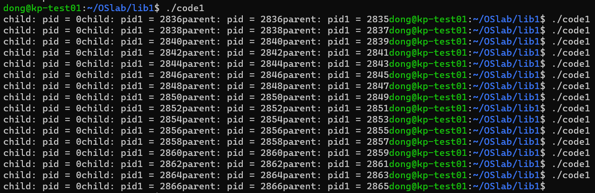
删去wait后运行结果
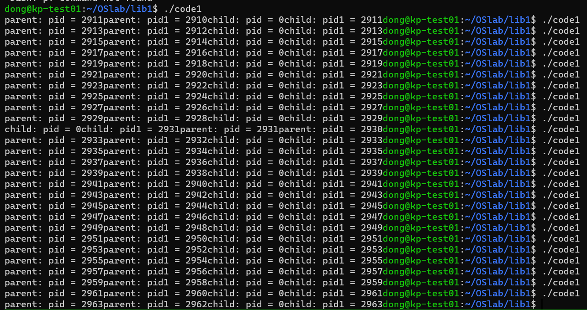
可以看到大多数情况下parent比child先执行, 但是偶尔会有不一样的情况.   
对代码进行如下改变: 在子进程中讲value值加一, 而在父进程中则不对value进行改变  
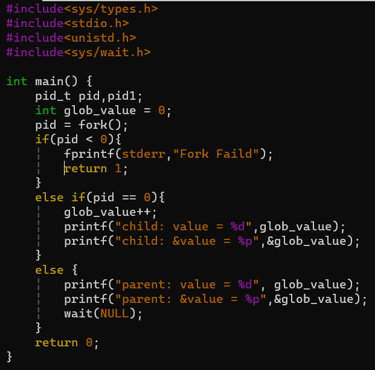
运行结果如下
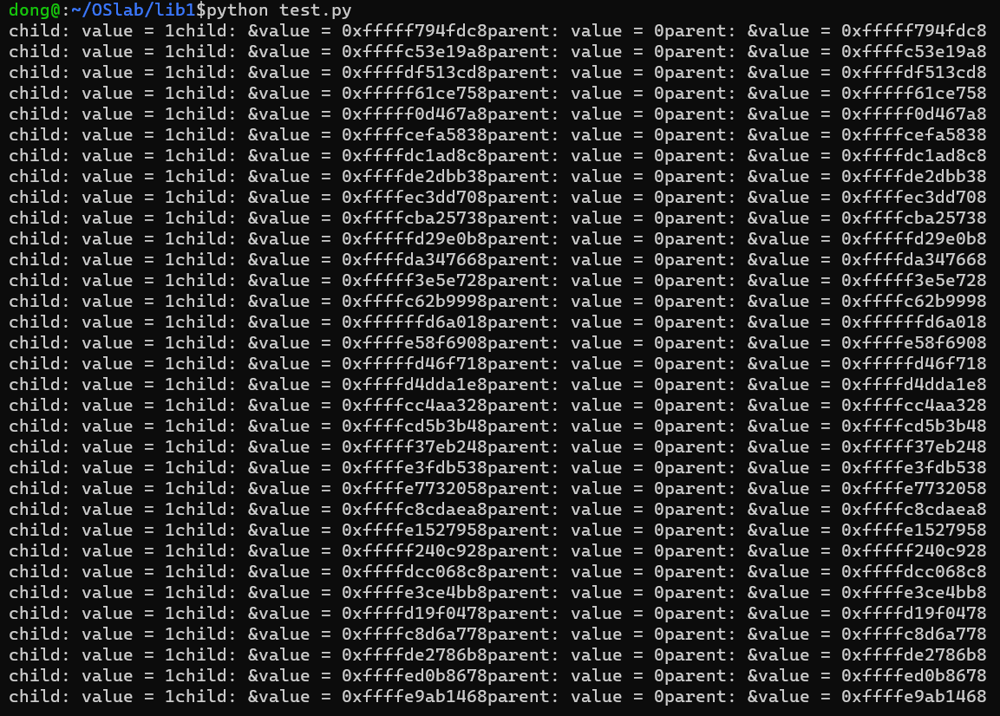
可以观察到父子进程中value值虽然不一样, 但是他们的地址相同. 
在return前增加对全局变量的操作后(value*=2), 运行结果如下
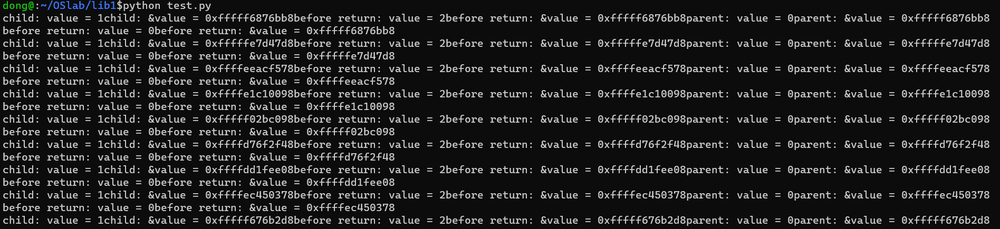
可以发现, 两个进程中的value值仍然是独立的.  
对以上实验结果, 我的解释是在调用fork函数时, 原本运行的进程创建了一个新的进程, 而新进程是与父进程完全一样的副本, 他们当中的变量值及变量的地址值完全相同. 但是由于操作系统的虚拟内存机制, 两个进程都拥有独立的虚拟内存空间, 因此即使两个进程中所有变量的地址都相同, 他们在实际内存中的物理地址也不一定相同, 因此他们对这些变量的操作也互不影响.  
在子进程2中调用system 或 exec函数, 代码如下  
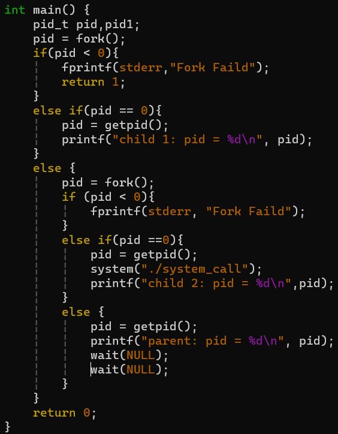
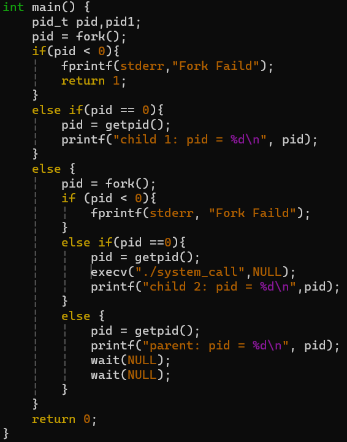
system_call函数实现如下  
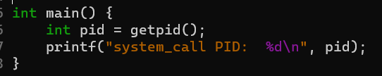
运行结果如下
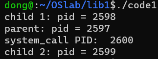
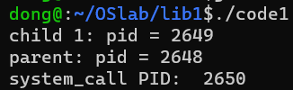
原因解释: system函数是调用操作系统内核运行参数中写出的shell命令, 而操作系统会新建一个进程来运行这个命令. exec函数族是将当前进程改造成一个新进程并运行输入参数中的命令.  

# 1.2 线程相关变成实验
在线程函数中,每次将全局变量+1, 多次运行效果如图  
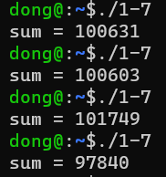
原因: 对一个变量的自增操作不是一个原子的指令, 他要经历取数, 自增再放回的过程, 有可能会出现以下冲突: 线程1取数后被切换出去, 线程2也开始取数, 则两个线程取得的数相同, 他们在放回时先放回的值会被后放回的值覆盖, 所以最终的总值比两个线程各做的自增数之和要小.  
增加信号量, 加函数等待add信号, 执行完毕后发送sub信号; 减函数等待sub信号, 执行完毕后发送add信号.  
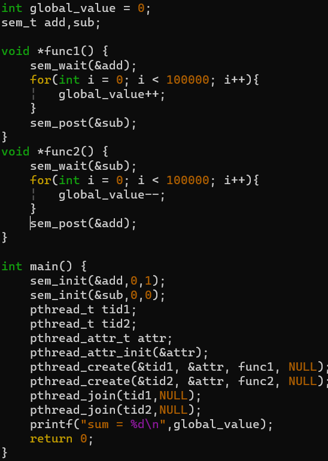
运行结果如下  
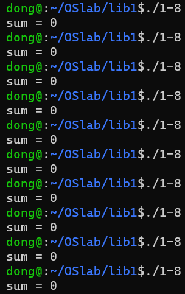
调用system函数
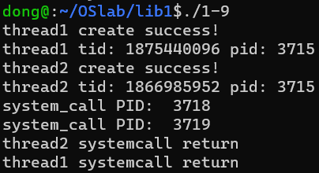
调用exec函数
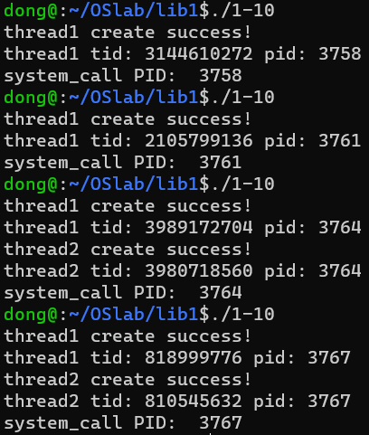
调用exec函数后进程被破坏, 装载入新的代码, 因此没有执行到的代码不再继续进行. 

# 1.3 自旋锁实验
运行结果如图
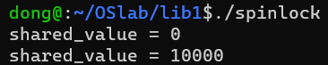