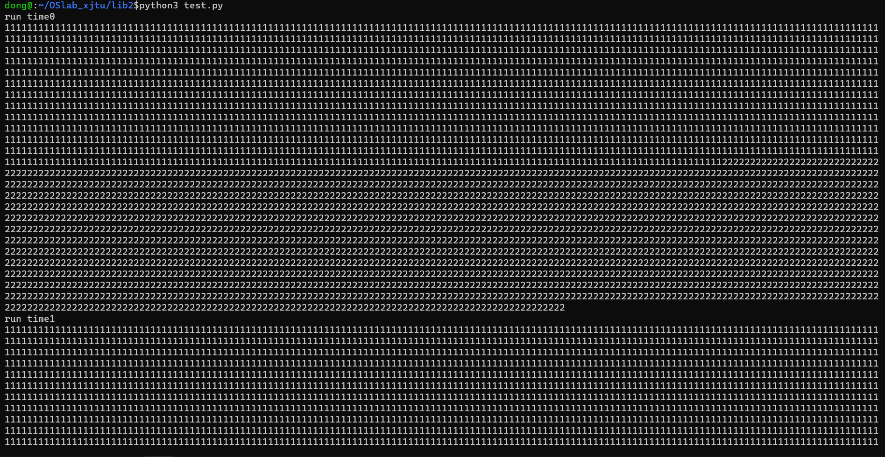
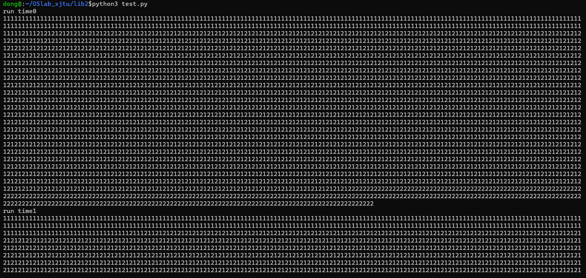
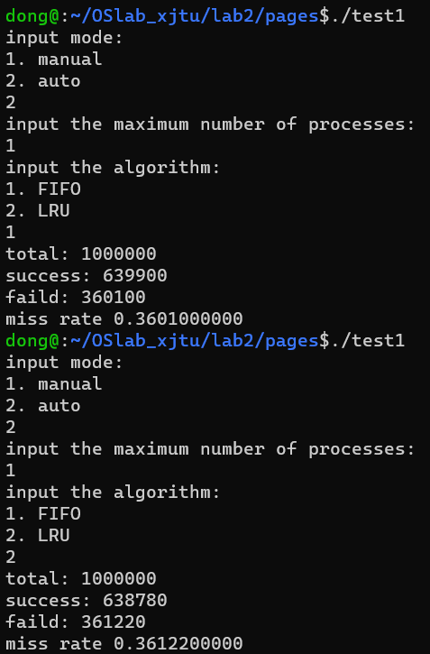
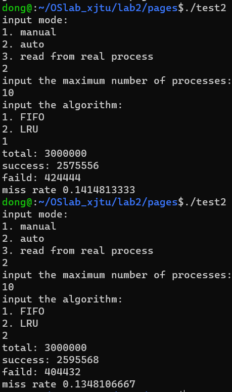
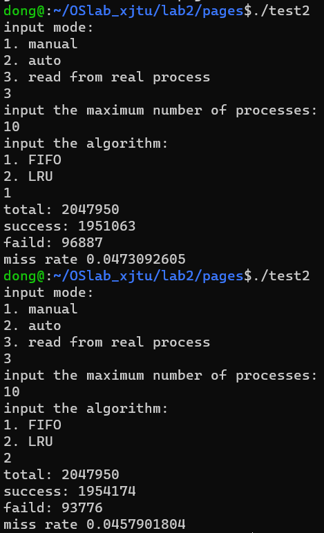

- [2.1 进程的软中断通信](#21-进程的软中断通信)
  - [实验思路:](#实验思路)
  - [遇到的问题及解决方案:](#遇到的问题及解决方案)
- [2.2 进程的管道通信](#22-进程的管道通信)
  - [实验思路:](#实验思路-1)
  - [实验结果记录:](#实验结果记录)
- [2.3 内存的分配与回收](#23-内存的分配与回收)
- [2.4 页面的置换](#24-页面的置换)

# 2.1 进程的软中断通信
## 实验思路:
在父进程中调用signal()改变父进程对三个信号的操作:SIGINT, SIGQUIT, SIGALRM, 让他们做出相同的操作--向两个子进程分别发送结束信号, 但由于他们分别输出不同的log信息, 因此将他们分在不同处理函数中. 接着调用pause()挂起进程等待信号.  
在子进程中调用signal()改变他们对相应信号的操作, 然后调用pause()挂起进程并等待信号的来临.  
在调试过程中, 发现当键盘输入SIGINT和SIGQUIT时会导致两个子进程收到信号后直接结束,导致结果与预期不符, 并且无法保证子进程接收到信号时已经完成了调用signal()的准备工作, 因此采取阻塞信号的方式, 将SIGINT, SIGQUIT, SIGCHILD, SIGSTKFLT四个信号阻塞, 当完成signal()准备工作后, 解除对SIGCHILD和SIGSTKFLT两个信号的阻塞以能够接收到父进程发来的信号. 经过这样的调整后输出结果符合预期.  
## 遇到的问题及解决方案:
- 如何阻塞信号  
解决方案: 在CSAPP一书第8.5节找到关于信号阻塞的相关知识.  
- 关于signal(), alarm()等函数的使用  
解决方案: 阅读man page解决  

# 2.2 进程的管道通信
## 实验思路:  
简单按照注释补全代码  
## 实验结果记录:  
在有锁的情况下:  

在没锁的情况下:  

# 2.3 内存的分配与回收
实现思路: 
1.  FF: 将空闲块列表按照起始地址从低到高排列. 
2.  BF: 将空闲块的大小从小到大排列.
3.  WF: 将空闲块的大小从大到小排列.  
实现方式: 首先遍历一遍链表,并将每个结点装入指针链表中(方便后序的排序操作). 排序使用标准库中的qsort函数, 为此实现了三个辅助函数.   
4. free: 创建一个新的空闲块, 并将其数据设置为与要free的块相同, 然后将其插入空闲块列表中. 随后立即进行空闲块的合并.  
5. merge: 先将空闲块队列按照FF顺序排列(此时队列中起始地址升序排列), 然后遍历整个队列, 若发现两个块相邻, 则将后块并入前块, 并删除后块. 迭代整个队列完成空闲块的合并后按照当前算法重排队列.  
6. do_exit: 程序退出前释放所有空间, 迭代两个队列释放空间.  

# 2.4 页面的置换
当随机访存时, 发现两种算法几乎没有差异

采用自动模拟

采用真实程序

 
